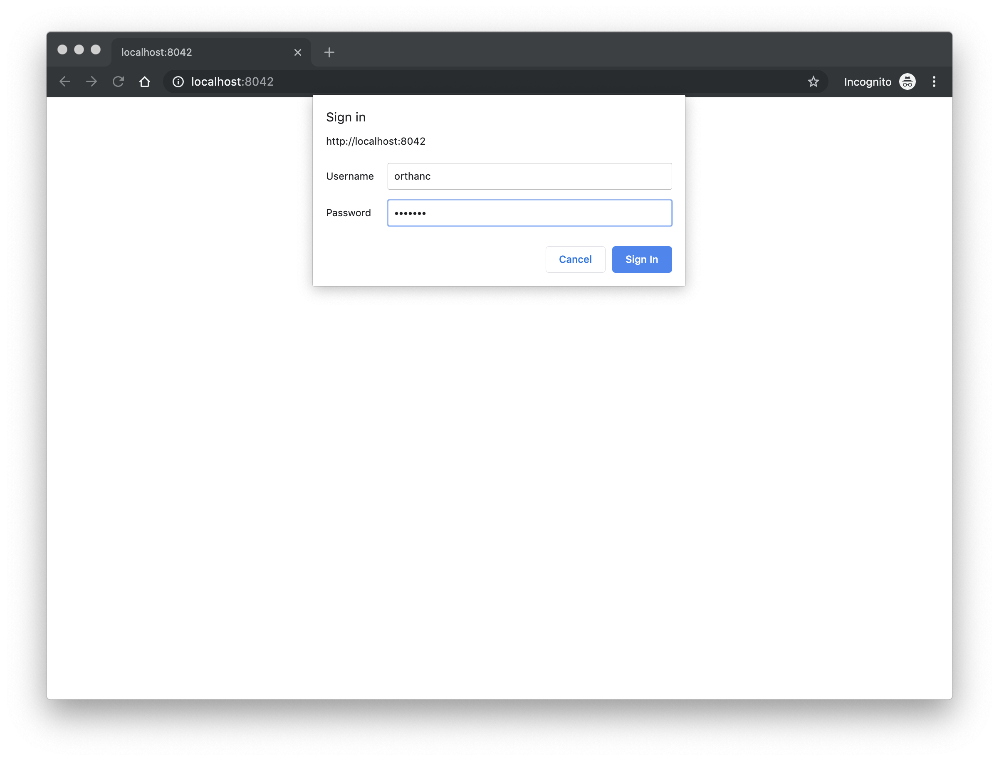
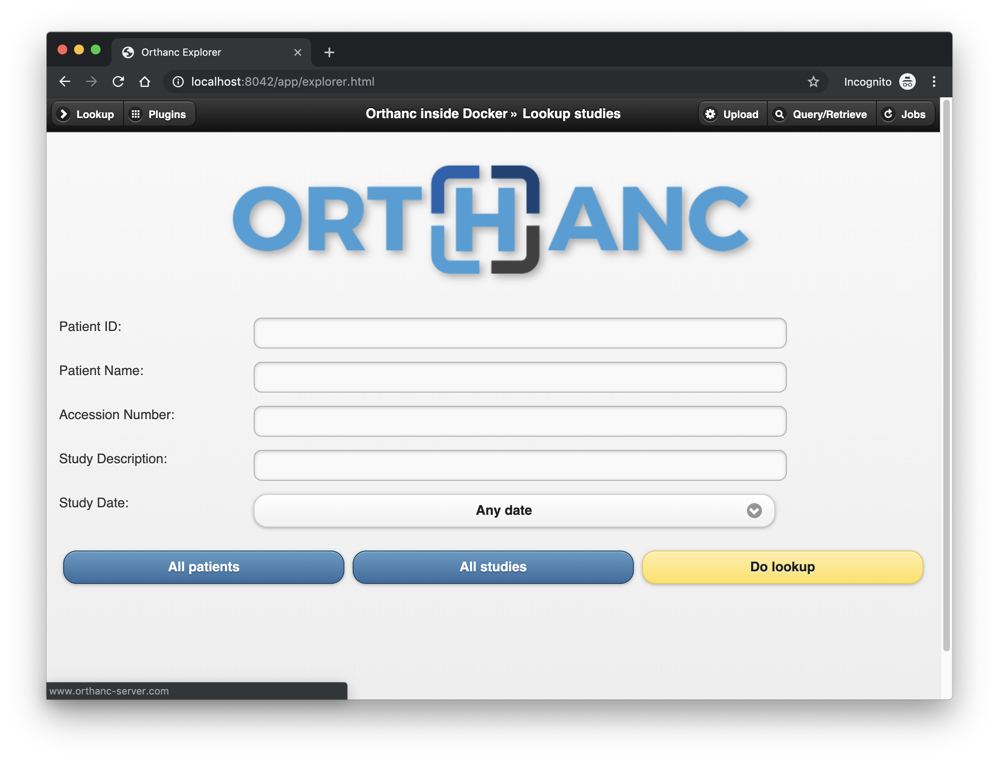

# OHIF Viewer/Orthanc in Docker

Docker Compose implementation of OHIF Viewer with Orthanc:

- Orthanc: [jodogne/orthanc-plugins:latest](https://hub.docker.com/r/jodogne/orthanc-plugins)
- PostgreSQL 11: [postgres:11](https://hub.docker.com/_/postgres)
- OHIF Viewer: [viewer:travis-757](https://hub.docker.com/r/ohif/viewer)
- MongoDB: [mongo:latest](https://hub.docker.com/_/mongo)


Orthanc docker containers as described at [http://book.orthanc-server.com/users/docker.html](http://book.orthanc-server.com/users/docker.html)

OHIF Viewer docker containers as described at [https://github.com/OHIF/Viewers](https://github.com/OHIF/Viewers)

Sample DICOM images downloaded from [https://www.dicomlibrary.com](https://www.dicomlibrary.com)

## TL;DR

Start postgres and mongo and wait for postgres to finish it's setup (Look for **database system is ready to accept connections** when looking at the output of `docker-compose logs postgres`)

```
docker-compose up -d postgres mongo
```

Start orthanc and viewer

```
docker-compose up -d orthanc viewer
```

Once completed you should see four containers running

```console
$ docker-compose ps
  Name                Command              State                       Ports
-------------------------------------------------------------------------------------------------
mongo      docker-entrypoint.sh mongod     Up      0.0.0.0:27017->27017/tcp
orthanc    Orthanc /etc/orthanc/           Up      0.0.0.0:4242->4242/tcp, 0.0.0.0:8042->8042/tcp
postgres   docker-entrypoint.sh postgres   Up      0.0.0.0:5432->5432/tcp
viewer     pm2-runtime app.json            Up      0.0.0.0:3000->3000/tcp
```

Go to [http://localhost:8042/]() and Sign in

- Username: **orthanc**
- Password: **orthanc**

Load the sample data from the `dicom-samples` directory (Upload tab)

Go to [http://localhost:3000/studylist]() and double click on the loaded study

Enjoy!


## Usage

### Update `.env` file

Update the .env file that docker-compose.yml will use to define the PostgreSQL and Orthanc parameters

```env
# PostgreSQL database - default values should not be used in production
PGDATA=/var/lib/postgresql/data
POSTGRES_DB=orthanc
POSTGRES_PASSWORD=pgpassword
POSTGRES_PORT=5432
POSTGRES_USER=postgres

# Orthanc core with plugins
ORTHANC_DICOM_PORT=4242
ORTHANC_HTTP_PORT=8042
```

### Update `docker-compose.yml` file

Update the docker-compose.yml file to appropriaty map the volume mounts for PostgreSQL database data and Orthanc data. Defaults are present working directory from where the compose file is invoked.

```docker
...
  postgres:
...
    volumes:
      - ./pg_data/data:${PGDATA:-/var/lib/postgresql/data}
...
  orthanc:
...
    volumes:
      - ./orthanc-db:/var/lib/orthanc/db
...
  mongo:
...
    volumes:
      - ./mongo_data:/data/db
...
```

### Run the compose services

Run the services defined in docker-compose.yml and daemonize them.

The postgres and mongo containers should be started first

```
docker-compose up -d postgres mongo
```

You should notice two containers running on the host.

```console
$ docker-compose ps
  Name                Command              State            Ports
---------------------------------------------------------------------------
mongo      docker-entrypoint.sh mongod     Up      0.0.0.0:27017->27017/tcp
postgres   docker-entrypoint.sh postgres   Up      0.0.0.0:5432->5432/tcp
```

Next start the orthanc and viewer containers

```
docker-compose up -d orthanc viewer
```

Once completed you should see four containers running

```console
$ docker-compose ps
  Name                Command              State                       Ports
-------------------------------------------------------------------------------------------------
mongo      docker-entrypoint.sh mongod     Up      0.0.0.0:27017->27017/tcp
orthanc    Orthanc /etc/orthanc/           Up      0.0.0.0:4242->4242/tcp, 0.0.0.0:8042->8042/tcp
postgres   docker-entrypoint.sh postgres   Up      0.0.0.0:5432->5432/tcp
viewer     pm2-runtime app.json            Up      0.0.0.0:3000->3000/tcp
```

It will take a few moments for the `posgres` container to complete it's start up scripts, but when completed the container logs should look similar to this:

```console
$ docker-compose logs postgres
...
postgres    |
postgres    | PostgreSQL init process complete; ready for start up.
postgres    |
postgres    | 2019-04-25 19:01:47.301 UTC [1] LOG:  listening on IPv4 address "0.0.0.0", port 5432
postgres    | 2019-04-25 19:01:47.301 UTC [1] LOG:  listening on IPv6 address "::", port 5432
postgres    | 2019-04-25 19:01:47.305 UTC [1] LOG:  listening on Unix socket "/var/run/postgresql/.s.PGSQL.5432"
postgres    | 2019-04-25 19:01:47.392 UTC [61] LOG:  database system was shut down at 2019-04-25 19:01:47 UTC
postgres    | 2019-04-25 19:01:47.420 UTC [1] LOG:  database system is ready to accept connections
```

### Validate in browser

If using the default configuration as defined above, the Sign-In screen will be available at: [http://localhost:8042/]()

- username: **orthanc**
- password: **orthanc**



Once signed in the explorer page should be presented:




## Clean up

```
docker-compose stop && docker-compose rm -f
docker volume prune -f
docker network prune -f
rm -rf mongo_data orthanc_db pg_data
```

## References

- Othanc: [http://book.orthanc-server.com/index.html](http://book.orthanc-server.com/index.html)
- OHIF Viewer: [https://docs.ohif.org](https://docs.ohif.org)
- DICOM Library: [https://www.dicomlibrary.com](https://www.dicomlibrary.com)
