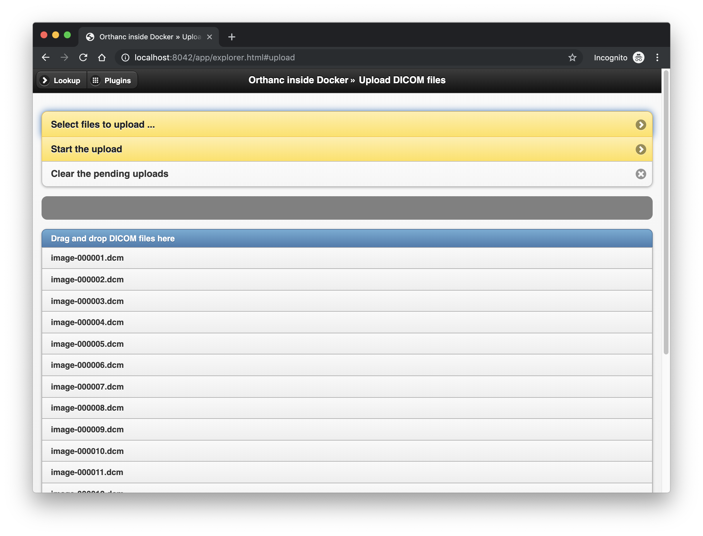
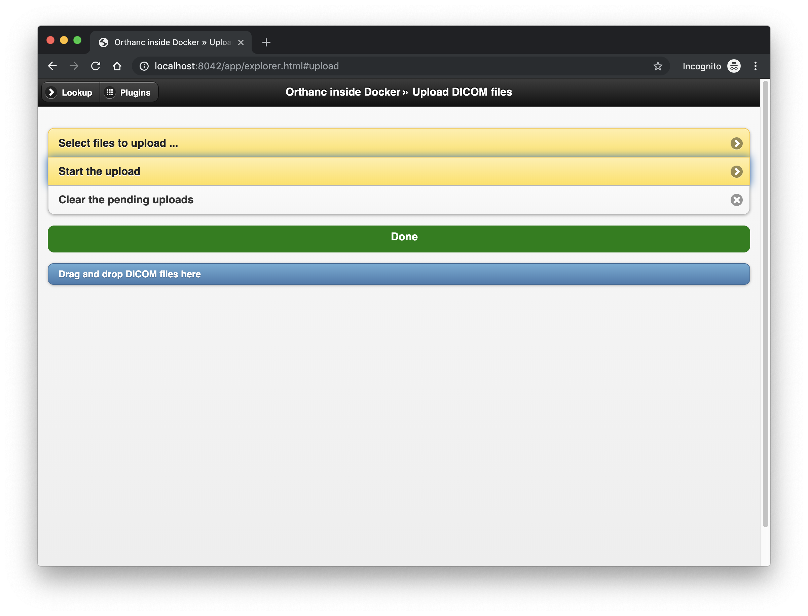
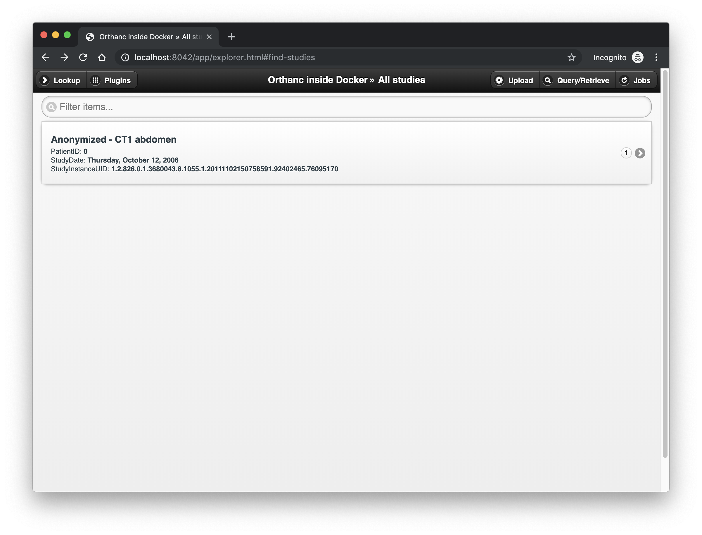
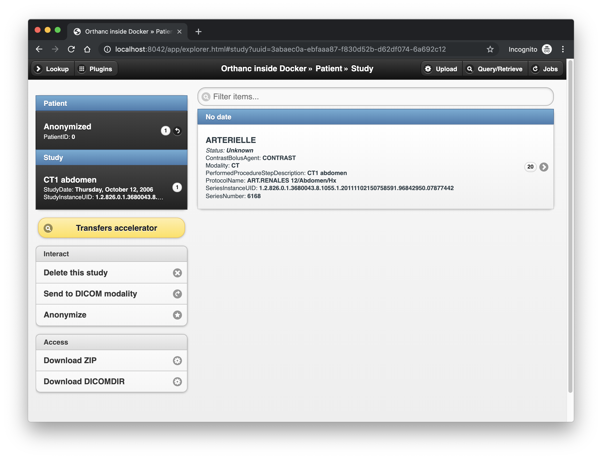
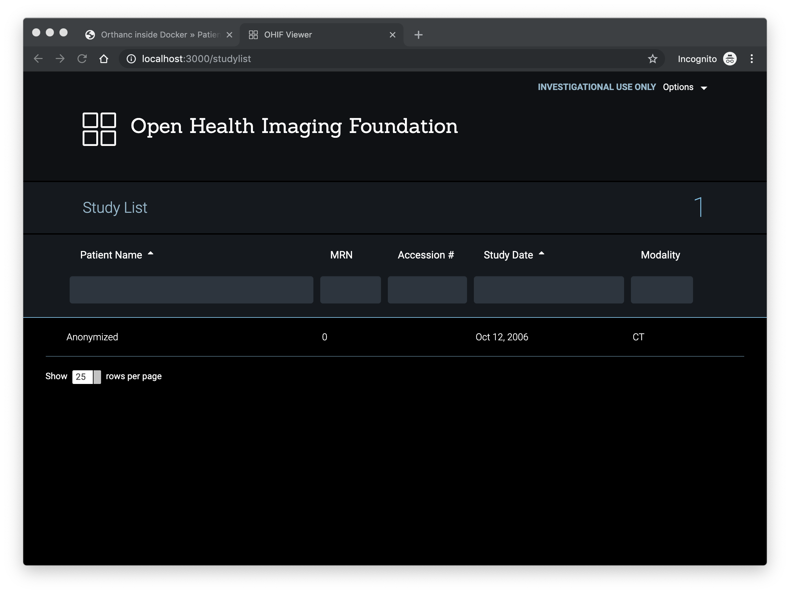
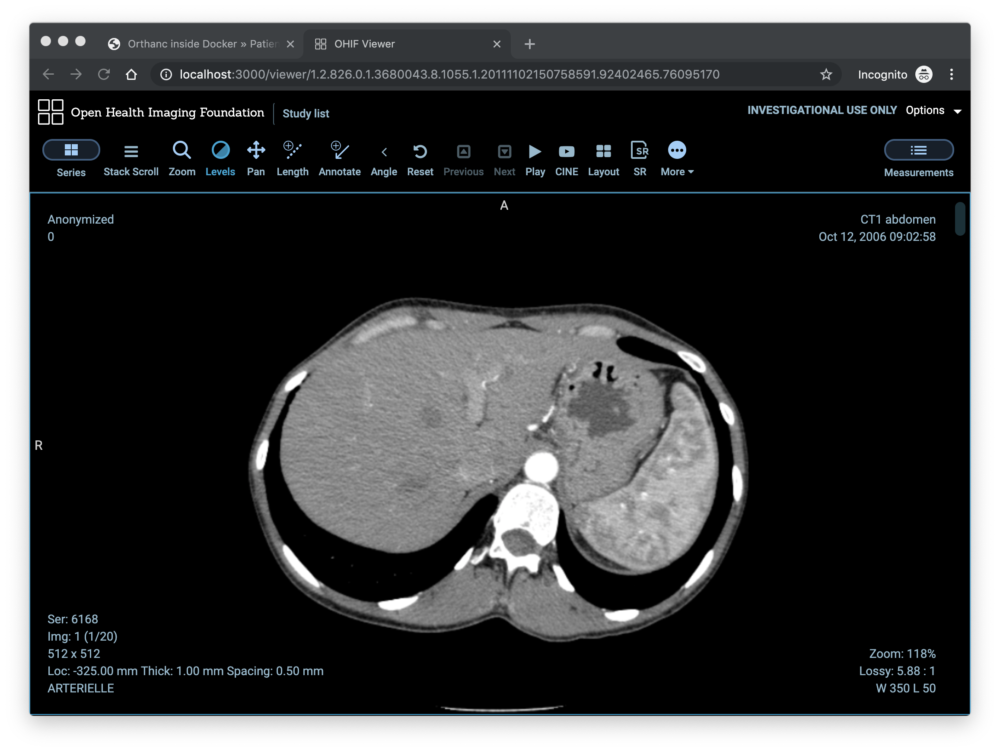

# OHIF Viewer - Orthanc with DIMSE in Docker

Docker Compose implementation of OHIF Viewer using Orthanc with DIMSE

- Orthanc: [jodogne/orthanc-plugins:latest](https://hub.docker.com/r/jodogne/orthanc-plugins)
- PostgreSQL 11: [postgres:11](https://hub.docker.com/_/postgres)
- OHIF Viewer: [viewer:latest](https://hub.docker.com/r/ohif/viewer)
- MongoDB: [mongo:latest](https://hub.docker.com/_/mongo)

This work is intended to be a complete working example of a docker based deployment demonstrating the OHIF Viewer using Orthanc as the image store. This work should not be considered production as presented, but rather a sane starting point for further implementation of security related features.

- Orthanc docker containers as described at [http://book.orthanc-server.com/users/docker.html](http://book.orthanc-server.com/users/docker.html)
- OHIF Viewer docker containers as described at [https://github.com/OHIF/Viewers](https://github.com/OHIF/Viewers)
- Sample DICOM images downloaded from [https://www.dicomlibrary.com](https://www.dicomlibrary.com)

## TL;DR

Run the services defined in docker-compose.yml and daemonize them.

```
docker-compose up -d
```

Once completed you should see four containers running

```console
$ docker-compose ps
  Name                Command              State                       Ports
-------------------------------------------------------------------------------------------------
mongo      docker-entrypoint.sh mongod     Up      0.0.0.0:27017->27017/tcp
orthanc    Orthanc /etc/orthanc/           Up      0.0.0.0:4242->4242/tcp, 0.0.0.0:8042->8042/tcp
postgres   docker-entrypoint.sh postgres   Up      0.0.0.0:5432->5432/tcp
viewer     pm2-runtime app.json            Up      0.0.0.0:3000->3000/tcp
```

Wait a few moments for the setup scripts to run and go to [http://localhost:8042/]() and Sign in

- Username: **orthanc**
- Password: **orthanc**

Load the sample data from the `dicom-samples` directory (Upload tab)

Go to [http://localhost:3000/studylist]() and double click on the loaded study

Enjoy!

**DEPLOYMENT NOTE**

Presently the `orthanc` container does not have any graceful checks for when the `postgres` container is ready to accept connections, so it can potentially fail and restart prior to gaining a successful connection. It would be preferrable to start the `postgres` container first, and then start the `orthanc` container once PostgreSQL is ready.

Start the postgres and mongo containers, and wait for postgres to finish it's setup (Look for **database system is ready to accept connections** when looking at the output of `docker-compose logs postgres`)

```
docker-compose up -d postgres mongo
```

Then start orthanc and viewer containers

```
docker-compose up -d orthanc viewer
```

## Configuration and Usage

### Update `.env` file

The `.env` file defines the PostgreSQL, Orthanc, MongoDB and OHIF Viewer parameters that will be used by the Docker containers running your services. The default values are shown below.

```bash
# PostgreSQL database - default values should not be used in production
PGDATA=/var/lib/postgresql/data
POSTGRES_DB=orthanc
POSTGRES_DATA_MNT=./pg_data/data
POSTGRES_PASSWORD=pgpassword
POSTGRES_PORT=5432
POSTGRES_USER=postgres

# Orthanc core with plugins
ORTHANC_CONFIG=./config/orthanc.json
ORTHANC_DB_MNT=./orthanc_db
ORTHANC_DICOM_PORT=4242
ORTHANC_HTTP_PORT=8042

# MongoDB
MONGO_DATA_MNT=./mongo_data
MONGO_PORT=27017
MONGO_URL=mongodb://mongo:27017/ohif

# OHIF Viewer
VIEWER_CONFIG=./config/viewer.json
```

**NOTE**: The default configuration files for Orthanc and OHIF Viewer are in the [config/](config) directory. It is left to the user to update these for their own use. Links to supporting documentation can be found in the References section.

### Run the compose services

Run the services defined in docker-compose.yml and daemonize them.

The postgres and mongo containers should be started first

```
docker-compose up -d postgres mongo
```

You should notice two containers running on the host.

```console
$ docker-compose ps
  Name                Command              State            Ports
---------------------------------------------------------------------------
mongo      docker-entrypoint.sh mongod     Up      0.0.0.0:27017->27017/tcp
postgres   docker-entrypoint.sh postgres   Up      0.0.0.0:5432->5432/tcp
```

It will take a few moments for the `postgres` container to complete it's start up scripts, but when completed the container logs should look similar to this:

```console
$ docker-compose logs postgres
...
postgres    |
postgres    | PostgreSQL init process complete; ready for start up.
postgres    |
postgres    | 2019-04-25 19:01:47.301 UTC [1] LOG:  listening on IPv4 address "0.0.0.0", port 5432
postgres    | 2019-04-25 19:01:47.301 UTC [1] LOG:  listening on IPv6 address "::", port 5432
postgres    | 2019-04-25 19:01:47.305 UTC [1] LOG:  listening on Unix socket "/var/run/postgresql/.s.PGSQL.5432"
postgres    | 2019-04-25 19:01:47.392 UTC [61] LOG:  database system was shut down at 2019-04-25 19:01:47 UTC
postgres    | 2019-04-25 19:01:47.420 UTC [1] LOG:  database system is ready to accept connections
```

Next start the orthanc and viewer containers

```
docker-compose up -d orthanc viewer
```

Once completed you should see four containers running

```console
$ docker-compose ps
  Name                Command              State                       Ports
-------------------------------------------------------------------------------------------------
mongo      docker-entrypoint.sh mongod     Up      0.0.0.0:27017->27017/tcp
orthanc    Orthanc /etc/orthanc/           Up      0.0.0.0:4242->4242/tcp, 0.0.0.0:8042->8042/tcp
postgres   docker-entrypoint.sh postgres   Up      0.0.0.0:5432->5432/tcp
viewer     pm2-runtime app.json            Up      0.0.0.0:3000->3000/tcp
```

### Validate Orthanc in browser

If using the default configuration as defined above, the Sign-In screen will be available at: [http://localhost:8042/]()

- username: **orthanc**
- password: **orthanc**


Once signed in the explorer page should be presented:


Click the Upload link in the upper right corner and select files to upload from the [dicom-samples/](dicom-samples) directory.



Start the upload



From the home page, select All studies, and the uploaded files should be available as **Anonymized - CT1 abdomen**



Click the study and use the tools to interact with the loaded files.



### Validate OHIF Viewer in browser

If using the default configuration as defined above, the Study will be available at: [http://localhost:3000/]()

You should observe the Anonymized study we loaded from Orthanc as an option to interact with



Double click on the Anonymized study to load it



Refer to [Open Health Imaging Foundation](http://ohif.org/) for further options.

## Clean up

```
docker-compose stop && docker-compose rm -f
docker volume prune -f
docker network prune -f
rm -rf mongo_data orthanc_db pg_data
```

## References

- Othanc: [http://book.orthanc-server.com/index.html](http://book.orthanc-server.com/index.html)
- OHIF Viewer: [https://docs.ohif.org](https://docs.ohif.org)
- DICOM Library: [https://www.dicomlibrary.com](https://www.dicomlibrary.com)
